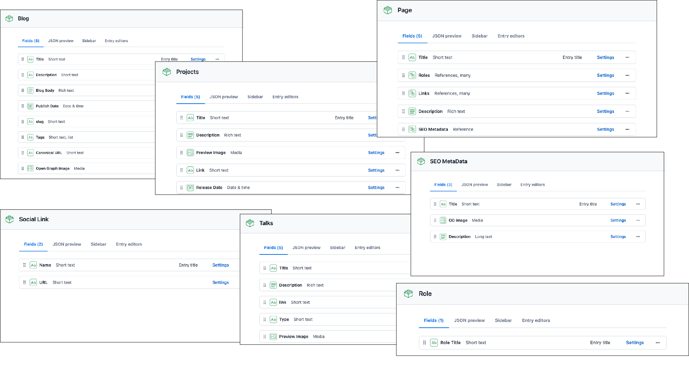
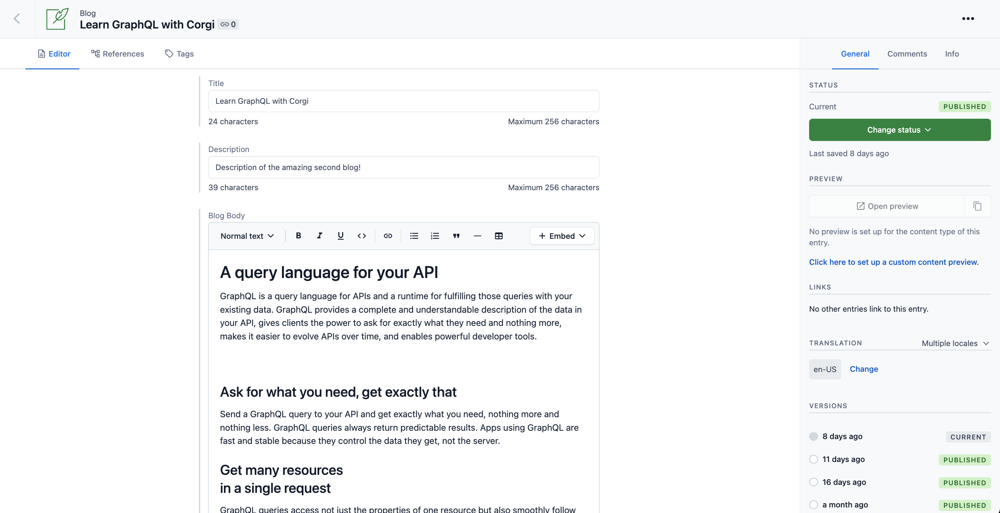

# Contentful Remix Portfolio Starter

Create your portfolio website powered by [Contentful](https://www.contentful.com/) and [Remix](https://remix.run)

## Demo

[https://contentful-remix-portfolio.netlify.app/](https://contentful-remix-portfolio.netlify.app/)


## Features

- Simple content model and structure. Easy to adjust to your needs.
- Uses the [Contentful GraphQL API](https://www.contentful.com/developers/docs/references/graphql/) to fetch the content.
- Uses the [rich-text-html-renderer](https://www.npmjs.com/package/@contentful/rich-text-html-renderer) to render Rich Text.

## Quick Start

Follow the steps mentioned below to set up and run the project quickly. For more detailed instructions, follow the steps mentioned in [Configuration](#configuration).

### Step 1. Get the source code and install dependencies

Run the following command in your terminal to clone the Contentful Remix stack.

```bash
npx create-remix@latest --template https://github.com/contentful/starter-remix-portfolio
```

Enter a name for your project, select your prefered language (TypeScript/JavaScript), and type Y to install the dependencies.

You will get an output as follow:

```bash
npx create-remix@latest --template contentful/starter-remix-portfolio
? Where would you like to create your app? corgi-portfolio
? TypeScript or JavaScript? JavaScript
? Do you want me to run `npm install`? Yes
⠼ Creating your app…(⠂⠂⠂⠂⠂⠂⠂⠂⠂⠂⠂⠂⠂⠂⠂⠂⠂⠂) ⠼ reify: timing arborist:ctor Completed
npm WARN ERESOLVE overriding peer dependency
...
...
```


### Step 2. Set up the content model

The stack comes with a Contentful set up command that imports the required content model and adds sample content to your space.

The command asks you for a [Space ID](https://www.contentful.com/help/find-space-id/), and [Content Management API](https://www.contentful.com/developers/docs/references/content-management-api/) Access Token, and the [Conetnt Delivery API](https://www.contentful.com/developers/docs/references/content-delivery-api/) Access Token.

Run the following command to set up the content model.

When prompted, enter the above mentioned details in the terminal respectively.

The output will be as follow:

```bash
...
209 packages are looking for funding
  run `npm fund` for details

found 0 vulnerabilities
💿 Running remix.init script
? Enter you Contentful Space ID SPACE_ID
? Enter you Content Delivery API Key CONTENT_DELIVERY_KEY
? Enter you Content Management Token CONTENT_MANAGEMENT_KEY
Creating .env file...
Updating files...
Removing temporary files from disk.
Running the setup script to import content model
┌──────────────────────────────────────────────────┐
│ The following entities are going to be imported: │
├────────────────────────────────┬─────────────────┤
│ Content Types                  │ 7               │
├────────────────────────────────┼─────────────────┤
│ Tags                           │ 0               │
├────────────────────────────────┼─────────────────┤
│ Editor Interfaces              │ 7               │
├────────────────────────────────┼─────────────────┤
│ Entries                        │ 29              │
├────────────────────────────────┼─────────────────┤
│ Assets                         │ 12              │
├────────────────────────────────┼─────────────────┤
│ Locales                        │ 1               │
├────────────────────────────────┼─────────────────┤
│ Webhooks                       │ 0               │
└────────────────────────────────┴─────────────────┘
(node:23674) ExperimentalWarning: The Fetch API is an experimental feature. This feature could change at any time
(Use `node --trace-warnings ...` to show where the warning was created)
  ✔ Validating content-file
  ✔ Initialize client (1s)
  ...
```


### Step 3. Run it locally

```bash
npm run dev
```

Navigate to `localhost:3000` to view the Portfolio.

## Configuration

### Step 1. Create an account and a space on Contentful

First, [create an account on Contentful](https://www.contentful.com/sign-up/).

After creating an account, create a new empty **space** from the [dashboard](https://app.contentful.com/) and assign to it any name of your liking.

### Step 2. Create a content model

The [content model](https://www.contentful.com/developers/docs/concepts/data-model/) defines the data structures of your application/websites. The structures are flexible and you can tailor them to your needs.

For this example you need to create a content model that defines a blog, page, projects, role, SEO metadata, social link, and talks content type. **You can create them automatically by using this stack or by doing it manually** to familiarize yourself with the Contentful user interface.


#### Create the content model manually

##### Create a `Role` content type

From your contentful space, go to **Content model** and add a new content type:

- Give it the **Name** `Role`, the **Api Identifier** should be `role`

Once the content model is saved, add these fields (you don't have to modify the settings unless specified):

- `Role Title` - **Text** field (type **short text**).

Save the content type and continue.

##### Create a `Social Link` content type

From your contentful space, go to **Content model** and add a new content type:

- Give it the **Name** `Social Link`, the **Api Identifier** should be `socialLink`

Once the content model is saved, add these fields (you don't have to modify the settings unless specified):

- `Name` - **Text** field (type **Short text**).
- `URL` - **Text** field (type **Short text**).
    - Click on **Create and configure**.
    - Under **Validation**, check **_Match a specific pattern_** and select ***URL*** from the dropdown list.

Save the content type and continue.

##### Create a `SEO MetaData` content type

From your contentful space, go to **Content model** and add a new content type:

- Give it the **Name** `SEO MetaData`, the **Api Identifier** should be `seoMetaData`

Once the content model is saved, add these fields (you don't have to modify the settings unless specified):

- `Title` - **Text** field (type **Short text**).
- `OG Image` - **Media** field (type **One file**).
- `Description` - **Text** field (type **Long text**).

Save the content type and continue.

##### Create a `Page` type

From your contentful space, go to **Content model** and add another content type:

- Give it the **Name** `Page`, the **Api Identifier** should be `page`

Next, add these fields (you don't have to modify the settings unless specified):

- `Title` - **Text** field (type **short text**).
- `Roles` - **Refrences** field (type **Many references**)
    - Click on **Create and configure**.
    - Under **Validation**, check **_Accept only a specified number of entries_**, select ***Not more than*** from the dropdown list, and enter ***3*** in the input field.
    - Under **Validation**, check **_Accept only specified entry type_** and select ***Role***.
- `Links` - **Refrences** field (type **Many references**)
    - Click on **Create and configure**.
    - Under **Validation**, check **_Accept only specified entry type_** and select ***Social Link***.
- `Description` - **Rich Text** field.
- `SEO Metadata` - **Refrences** field (type **Single references**)
    - Click on **Create and configure**.
    - Under **Validation**, check **_Accept only specified entry type_** and select ***SEO MetaData***.

Save the content type and continue.

##### Create a `Blog` type

From your contentful space, go to **Content model** and add another content type:

- Give it the **Name** `Blog`, the **Api Identifier** should be `blog`

Next, add these fields (you don't have to modify the settings unless specified):

- `Title` - **Text** field (type **Short text**).
- `Description` - **Text** field (type **Short text**).
- `Blog Body` - **Rich Text** field.
- `Publish Date` - **Date & time**
    - Click on **Create and configure**.
    - Click on the **Appearance** tab and select ***Date only*** from the **_Format_** dropdown list.
- `slug` - **Text** field. 
    - Click on **Create and configure**.
    - Under **Appearance**, select **Slug** to display it as a slug of the `Title` field.
- `Tags` - **Text** field (type **short text**)
    - Select **List**.
    - Click on **Create and configure**.
    - Under **Validation**, check **_Accept only specified values_** and enter the values.
    - Under **Appearance**, select **Checkbox**.
- `Canonical URL` - **Text** field (type **Short text**)
    - Click on **Create and configure**.
    - Under **Validation**, check **_Match a specific pattern_** and select ***URL*** from the dropdown list.
- `Open Graph Image` - **Media** field (type **Single file**).

Save the content type and continue.

##### Create a `Talks` type

From your contentful space, go to **Content model** and add another content type:

- Give it the **Name** `Talks`, the **Api Identifier** should be `talks`

Next, add these fields (you don't have to modify the settings unless specified):

- `Title` - **Text** field (type **Short text**).
- `Description` - **Rich Text** field.
- `Link` - **Text** field (type **Short text**)
    - Click on **Create and configure**.
    - Under **Validation**, check **_Match a specific pattern_** and select ***URL*** from the dropdown list.
- `Type` - **Text** field (type **short text**)
    - Click on **Create and configure**.
    - Under **Validation**, check **_Accept only specified values_** and enter the values.
    - Under **Appearance**, select **Dropdown**.
- `Preview Image` - **Media** field (type **Single file**).

Save the content type and continue.

##### Create a `Projects` type

From your contentful space, go to **Content model** and add another content type:

- Give it the **Name** `Talks`, the **Api Identifier** should be `talks`

Next, add these fields (you don't have to modify the settings unless specified):

- `Title` - **Text** field (type **Short text**).
- `Description` - **Rich Text** field.
- `Preview Image` - **Media** field (type **Single file**).
- `Link` - **Text** field (type **Short text**)
    - Click on **Create and configure**.
    - Under **Validation**, check **_Match a specific pattern_** and select ***URL*** from the dropdown list.
- `Publish Date` - **Date & time**
    - Click on **Create and configure**.
    - Click on the **Appearance** tab and select ***Date only*** from the **_Format_** dropdown list.

Save the content type and continue.


### Step 3. Validate your content model

After setting up the content model, it should look as follows.

**Content model overview**



### Step 4. Populate Content

Go to the **Content** section in your space, then click on **Add entry** and select the **Social Link** content type:

Do this for other content types as well.

**Important:** For each entry and asset, you need to click on **Publish**. If not, the entry will be in draft state.



### Step 5. Set up environment variables

From your contentful space, go to **Settings > API keys**. There will be an example Content delivery / preview token - you can use these API keys. (You may also create a new key.)

Next, copy the `.env.example` file in this directory to `.env` (which will be ignored by Git):

```bash
cp .env.example .env
```

Then set each variable on `.env`:

- `CONTENTFUL_SPACE_ID` should be the **Space ID** field of your API Key
- `CONTENTFUL_ACCESS_TOKEN` should be the **[Content Delivery API](https://www.contentful.com/developers/docs/references/content-delivery-api/) - access token** field of your API key

Your `.env` file should look like this:

```bash
CONTENTFUL_SPACE_ID=...
CONTENTFUL_ACCESS_TOKEN=...
```

### Step 6. Run in development mode

```bash
npm install
npm run dev

# or

yarn install
yarn dev
```

Your app should be up and running on [http://localhost:3000](http://localhost:3000)!

## Deploy

Click on the button below to deploy your portfolio to Netlify.

[](https://app.netlify.com/start/deploy?repository=https://github.com/contentful/starter-remix-portfolio.git
)

**NOTE:** You'll have to configure the ***CONTENTFUL_SPACE_ID*** and ***CONTENTFUL_ACCESS_TOKEN*** values.

You can also deploy manually, either via the Web app or the [CLI](https://www.netlify.com/products/dev/). Follow the instructions mentioned below to deploy to Netlify.


### Using Netlify UI

#### Step 1. Create and initialize a new GitHub repository

Log in to your GitHub account and create a new empty repository. On your terminal run the following commands:

```bash
# Initialize the repo
git init

# Add the files to the staging
git add .

# Commit the changes
git commit -m "first commit"

# OPTIONAL: Change the default branch
git branch -m main

# Add the remote origin. Make sure to use the correct GitHub username and the repository name
git remote add origin https://github.com/<GITHUB_USERNAME>/<REPOSITORY_NAME>.git

# Push the changes to the default branch
git push -u origin main

```

#### Step 2. Configure and deploy site on Netlify

1. Log in to your Netlify account and click on the ***Add new site*** or ***Import from Git*** button.
2. Under the **Connect to Git provider** section, select ***GitHub*** and provide the required authorization.
3. Select your newly created GitHub repository.
4. Click on the ***Show advanced*** button and click on ***New variable***.
5. Add the `CONTENTFUL_SPACE_ID` and `CONTENTFUL_ACCESS_TOKEN` environment variables.
6. Click on the ***Deploy site*** button.

After the successful build, you will be able to view your site!

### Using the CLI

#### Step 1. Install and authorize the Netlify CLI

1. In your terminal, run the following command to install the Netlify CLI.

```bash
npm i -g netlify-cli@latest
```

2. Log in to your Netlify account by running the following command.

```bash
netlify login
```

#### Step 2. Initialize and configure the site

1. Create a new Netlify site by running this command:

```bash
netlify init
```

2. Use the below command to import the environment variables from the `.env` file.

```bash
netlify env:import .env
```

#### Step 3. Deploy to Netlify

1. Build and deploy your portfolio using the following command.

```bash
netlify deploy --build --prod
```

After the successful build, you will be able to view your site!
